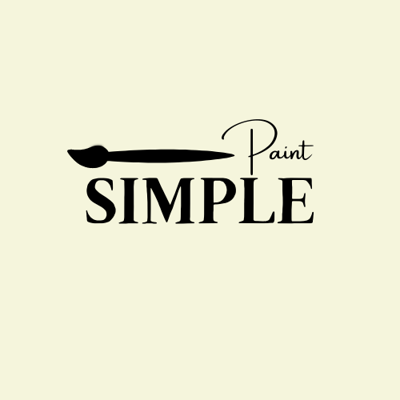
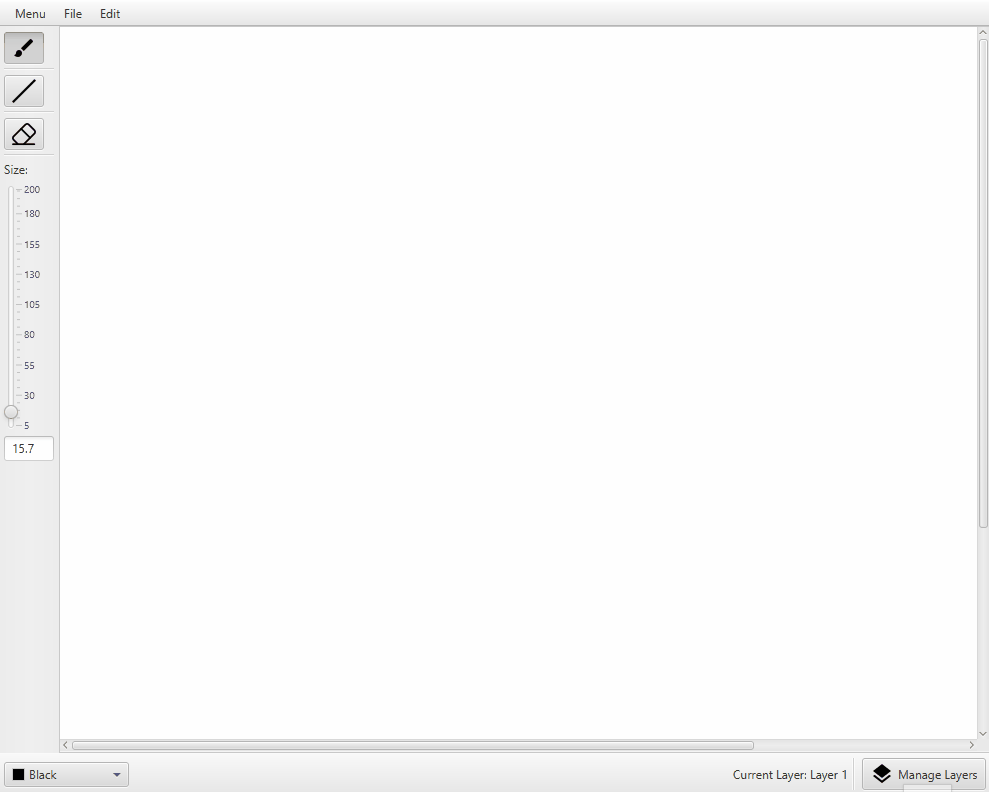
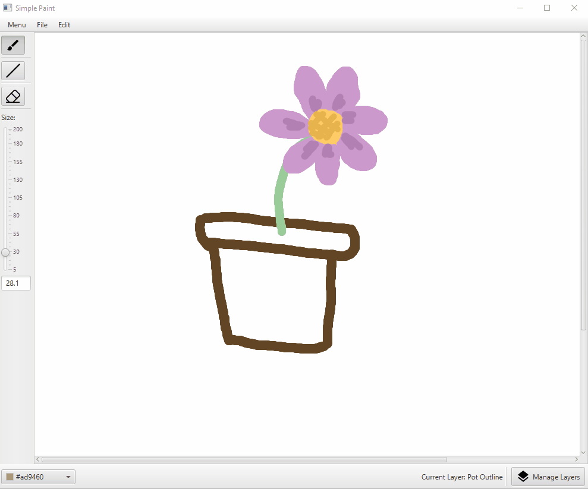

# Simple Paint

  </img>

<h3 style="text-align: center;">
  A basic Java painting application using JavaFX
</h3>

## About
Simple Paint is a simple painting application that I made in a week in 2021 as a student to learn about implementing an MVC (Model View Controller) design. Whilst it boasts nothing special, it does work as a basic painting program with a layer system and exporting funtionality, able to save your artwork in `.png` format.

It's built with:
- Java
- JavaFX

Overall, this project was a good learning experience which greatly helped me understand the relationship between MVCs.

It's features:
- Layer system
  - Clear all or a single layer
  - Reordering layers
- Exporting
  - Export as a `.png` image file
- Basic Drawing Tools
  - Brush 
  - Line tool
  - Eraser
- Tool Options
  - Size
  - Color

In addition to the source files, I left the *sketches* folder as a little bonus to remind myself of how far I've come as a developer. I personally find it funny to look back and see how I decided to outline the layout on physical paper. 

## How to run the Project

I created the project in IntelliJ which is preferred for Java applications.
After cloning the project:

- *Running the program from IntelliJ* is as simple as running `Main.java`.

- *Running it via other editors such as VSCode* may require some installation of the JavaFX library as it does not support it out of the box. 

## Demo

### Drawing Tools

### Layer System

## Contributing

Feel free to fork and make your own changes to the application as you see fit. I created this in a week but did not have the time to expand on it, but have always wanted to add new features and functionalities such as:
- More styling to the entire application (to remove that default JavaFX look)
- A marquee feature
- Undo/Redo functionality
- Canvas resizing
- Copy/Paste features
- etc..

## Contact

Contact me about anything at all through my email!

Jeremiah Sabino - jer.lsabino@gmail.com
